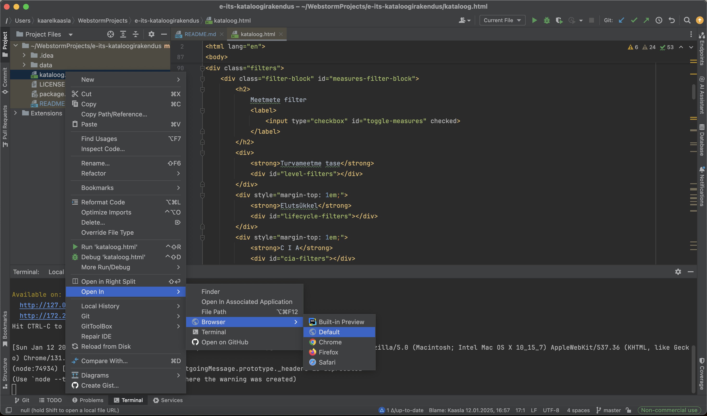

# E-ITS 2024 kataloogirakendus

See rakendus võimaldab filtreerida ja kuvada turvameetmeid (ja nendega seotud infot) vastavalt kasutaja valitud kriteeriumitele. Sisu tugineb kahele JSON-failile:

1. **profile_combo_250107.json** – sisaldab meetmete täiendavaid metaandmeid (nt `tags`, `iso`, `threats`), mille põhjal rakendus loob filtreid ja rikastab tulemusi.
2. **2024_eits_l3_250107.json** – sisaldab põhimeetmete andmestikku (nt `mid`, `title`, `content`, `level`, `lifecycle`) ja vastutajaid.

---

## Rakenduse käivitamine

Rakendust saab käivitada **kahel** viisil:

1. **IDE kaudu**  
   Avage projekt IDE-s (nt Visual Studio Code, WebStorm vms), leidke `kataloog.html` fail ja avage see otse IDE sisseehitatud serveriga või IDE eelvaates:

   

2. **Lihtsa HTTP-serveri abil**
   - Avage projekti juurkaust terminalis.
   - Jooksutage käsk:
     ```bash
     http-server .
     ```
     *(Võimalik, et vajate esmalt `npm install -g http-server`.)*
   - Avage brauseris aadress [`http://127.0.0.1:8080/kataloog.html`](http://127.0.0.1:8080/kataloog.html) (või muu port, mille server välja annab).

---

## Rakenduse funktsionaalsus

### 1. Meetmete filter
- **Turvameetme tase (`level`)**  
  Dünaamiliselt genereeritud kategooriad meetmete sisendfaili põhjal.
- **Elutsükkel (`lifecycle`)**  
  Dünaamiliselt genereeritud kategooriad sõltuvalt sisendfailis olevast.
- **C I A (`cia`)**  
  Dünaamiliselt genereeritud valikud, tavaliselt `C`, `I`, `A`, kuid võivad sisendfailist tulenevalt olla ka `CI` või `CIA` jms — kõik väärtused normaliseeritakse.

### 2. Moodulite filter
- **Kategooria (`tags`)**
   - Süsteemimoodul: `tags` sisaldab prefiksit `sys:`.
   - Protsessimoodul: `tags` sisaldab prefiksit `proc:`.
   - `muu`: kui kumbagi prefiksit ei leidu.
- **Moodulid (`module`)**  
  Dünaamilised kategooriad moodustatakse `module` väljade prefiksite järgi enne esimest punkti. Näiteks `ISMS.1` → `ISMS`.

### 3. Vastuste filter
- Kasutaja määrab, **millised** tunnused (veerud) on tulemuste tabelis nähtavad.
- Kui näiteks kasutaja lülitab välja `Meetme tase`, seda tabelis ei kuvata.
- See võimaldab **paindlikult** valida, kas tulemusi näidatakse pigem lühemal või detailsemal kujul.

### 4. Rollide filter
- **`responsible`** ja **`assignee`** väärtuste põhjal luuakse rollinimekiri.
- Kui roll ei esine üheski meetmes, siis seda nimekirjas ei kuvata.

### 5. Märksõna
- Kasutaja saab sisestada märksõna, mille alusel tehakse **täistekstotsing** väljade `mid`, `title` ja `content` pealt.
- Kui vaste leitakse, kuvatakse see **paksus kirjas** (tag `<strong>`) tulemuste tabelis, et otsingutulemused oleksid silmatorkavad.

---

## Tulemuste tabel

**Tabeli sisu** genereeritakse valitud filtrite ja märksõnaotsingu tulemusel:

1. **Filtreerimine**
   - Tabelisse lisatakse **ainult** need read, mis vastavad kõigile filtri- ja märksõnatingimustele.
   - Kui ükski filter ei keela konkreetset meedet, siis meede kuvatakse.

2. **Andmete kombineerimine**
   - Rakendus kasutab põhiandmefaili (`2024_eits_l3_250107.json`) ridu (mis sisaldab `mid`, `title`, `content`, `level`, `lifecycle` jne) ja rikastab neid metaandmetega (`iso`, `threats`, `tags`), mis leitakse `profile_combo_250107.json` failist, kasutades sidumiseks näiteks välju `mid` ↔ `measure`.

3. **Kuvamise veerud**
   - Millised täpselt kuvatakse, sõltub kasutaja valikutest `Vastuste filter` veerus:
      1. **Mooduli vastutaja** (`responsible`)
         - Näitab, kes on selle meetme peamine vastutaja (nt osakond, roll või isik).
      2. **Meetme nimetus** (`mid + title`)
         - Tabeli „nimetus“ veerg on liit `mid`-st (nt `ISMS.1.M1`) ja `title`-st (nt `Kindlustuslepingute sõlmimine (A)`).
      3. **Meetme sisu** (`content`)
         - Tekst, mis kirjeldab meetme teostust või sisu detailsemalt.
      4. **Kaasvastutaja** (`assignee`)
         - Näitab, kas on keegi teine (roll või üksus), kellel on samuti vastutus meetme rakendamisel.
      5. **Meetme alusohud** (`threats`)
         - Kui sisendfailis on määratud ohtude loetelu, kuvatakse need siia veergu.
      6. **ISO27001 vastavus** (`iso`)
         - Näitab, millisesse ISO27001 kontrollpunkti meede kuulub, kui sisendfail seda annab.
      7. **Meetme tase** (`level`)
         - Rakenduse loogika kasutab seda turvameetmete klassifitseerimiseks.
      8. **Meetme elutsükkel** (`lifecycle`)
         - Rakendus kasutab seda meetme eluea faasi kontekstis.

4. **Märksõna otsingu esiletõst**
   - Kui kasutaja on sisestanud märksõna, tähistatakse kõik leitud vasted `<strong>` tag'iga, et need tulemustes esile tuua.

---

## Kataloogistruktuur

- **`kataloog.html`** – Põhifail, kuhu on koondatud HTML, CSS ja JavaScript. Avamiseks brauseris või IDE-s.
- **`data/`** – JSON-failidega kaust:
   - `profile_combo_250107.json` – Meetme metaandmed (`tags`, `iso`, `threats` jne).
   - `2024_eits_l3_250107.json` – Põhimeetmed (`mid`, `title`, `content` jne).
- **`media/`** – Pildifailid (nt ekraanipilt `open-using-ide.png`). 